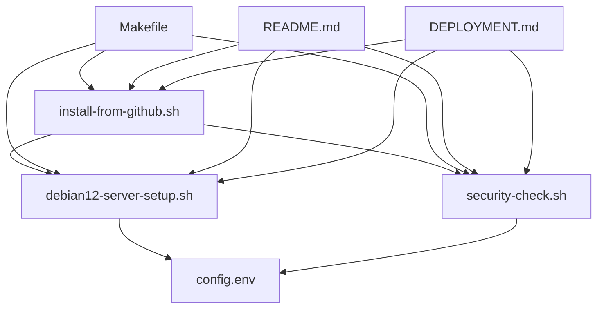

# Описание файлов проекта Debian 12 Server Setup

## Обзор

Этот документ содержит описание всех файлов в проекте настройки и защиты сервера Debian 12.

## Основные файлы

### 1. `debian12-server-setup.sh`
**Назначение**: Основной скрипт настройки сервера Debian 12
**Размер**: ~15KB
**Описание**: 
- Комплексная настройка системы безопасности
- Установка необходимых пакетов
- Конфигурация SSH, файрвола, fail2ban
- Настройка мониторинга и резервного копирования
- Создание пользователя администратора
- Оптимизация сетевых параметров

**Ключевые функции**:
- Проверка прав root и версии Debian
- Обновление системы и установка пакетов
- Настройка безопасности (SSH, UFW, fail2ban)
- Создание системы мониторинга
- Настройка автоматических обновлений
- Создание отчетов о настройке

### 2. `security-check.sh`
**Назначение**: Скрипт проверки безопасности настроенного сервера
**Размер**: ~8KB
**Описание**:
- Комплексная проверка настроек безопасности
- Анализ конфигурации SSH, файрвола, fail2ban
- Проверка пользователей и служб
- Анализ сетевых настроек
- Проверка логов безопасности
- Создание отчета о безопасности

**Ключевые функции**:
- Проверка SSH конфигурации
- Анализ файрвола UFW
- Проверка fail2ban
- Анализ пользователей и групп
- Проверка открытых портов
- Создание отчета о безопасности

### 3. `install-from-github.sh`
**Назначение**: Скрипт быстрой установки с GitHub
**Размер**: ~4KB
**Описание**:
- Автоматическое скачивание и запуск основного скрипта
- Установка скрипта проверки безопасности
- Создание алиасов и утилит
- Генерация информационных файлов

**Ключевые функции**:
- Проверка подключения к интернету
- Скачивание скриптов с GitHub
- Установка зависимостей
- Создание алиасов для удобства
- Генерация отчетов

## Конфигурационные файлы

### 4. `config.env`
**Назначение**: Файл конфигурации с переменными окружения
**Размер**: ~3KB
**Описание**:
- Все настраиваемые параметры скриптов
- Настройки безопасности
- Параметры мониторинга
- Конфигурация сети и времени
- Настройки резервного копирования

**Основные секции**:
- Основные настройки системы
- Параметры пользователей
- Настройки SSH и безопасности
- Конфигурация файрвола и fail2ban
- Параметры мониторинга
- Настройки GitHub репозитория

### 5. `Makefile`
**Назначение**: Makefile для управления проектом
**Размер**: ~2KB
**Описание**:
- Удобные команды для работы со скриптами
- Автоматизация тестирования и проверки
- Создание архивов и документации
- Управление зависимостями

**Основные команды**:
- `make install` - Установка с GitHub
- `make setup` - Локальная настройка
- `make security` - Проверка безопасности
- `make check` - Проверка скриптов
- `make test` - Тестирование
- `make validate` - Валидация конфигурации

## Документация

### 6. `README.md`
**Назначение**: Основная документация проекта
**Размер**: ~8KB
**Описание**:
- Подробное описание возможностей
- Инструкции по установке и использованию
- Примеры команд и конфигураций
- Руководство по устранению неполадок
- Рекомендации по безопасности

**Основные разделы**:
- Описание возможностей
- Способы установки
- Конфигурация и настройка
- Использование и команды
- Устранение неполадок
- Поддержка и сообщество

### 7. `DEPLOYMENT.md`
**Назначение**: Руководство по развертыванию
**Размер**: ~6KB
**Описание**:
- Детальные инструкции по развертыванию
- Предварительные требования
- Пошаговый процесс установки
- Конфигурация и настройка
- Мониторинг и обслуживание

**Основные разделы**:
- Предварительные требования
- Способы установки
- Процесс установки
- Использование Makefile
- Мониторинг и обслуживание
- Устранение неполадок

### 8. `FILES.md`
**Назначение**: Описание файлов проекта (данный файл)
**Размер**: ~2KB
**Описание**:
- Подробное описание всех файлов проекта
- Назначение и размер каждого файла
- Ключевые функции и возможности
- Структура и организация проекта

## Структура проекта

```
debian12/
├── debian12-server-setup.sh    # Основной скрипт настройки (15KB)
├── security-check.sh           # Скрипт проверки безопасности (8KB)
├── install-from-github.sh      # Скрипт установки с GitHub (4KB)
├── config.env                   # Конфигурационный файл (3KB)
├── Makefile                     # Makefile для управления (2KB)
├── README.md                    # Основная документация (8KB)
├── DEPLOYMENT.md               # Руководство по развертыванию (6KB)
└── FILES.md                    # Описание файлов (2KB)
```

**Общий размер проекта**: ~48KB

## Использование файлов

### Для пользователей
1. **Быстрая установка**: Используйте `install-from-github.sh`
2. **Локальная установка**: Используйте `debian12-server-setup.sh`
3. **Проверка безопасности**: Используйте `security-check.sh`
4. **Настройка**: Измените параметры в `config.env`

### Для разработчиков
1. **Управление**: Используйте команды из `Makefile`
2. **Тестирование**: `make test` и `make check`
3. **Валидация**: `make validate`
4. **Документация**: Изучите `README.md` и `DEPLOYMENT.md`

## Зависимости между файлами



## Версионирование

Все файлы синхронизированы по версиям:
- **v1.0** - Первоначальная версия
- Все файлы имеют одинаковую версию
- Изменения в одном файле могут потребовать обновления других

## Безопасность

### Проверка целостности
```bash
# Проверка хешей файлов
sha256sum *.sh *.env *.md Makefile

# Проверка подписей (если доступны)
gpg --verify *.sig
```

### Права доступа
```bash
# Установка правильных прав
chmod 755 *.sh
chmod 644 *.md *.env Makefile
```

## Поддержка

При работе с файлами проекта:
1. Проверяйте актуальность версий
2. Изучайте документацию перед использованием
3. Тестируйте изменения в безопасной среде
4. Сохраняйте резервные копии конфигураций

---

**Примечание**: Этот документ обновляется при изменении структуры проекта.

